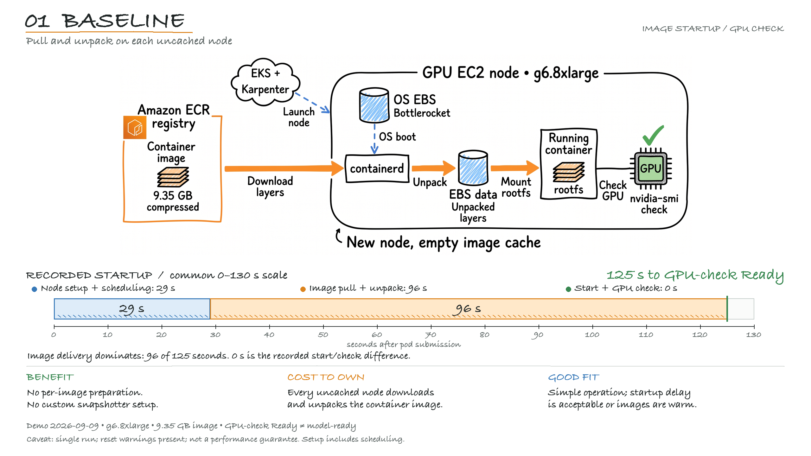

# Step 1 — Baseline: measure before changing anything

**English** | [日本語](#japanese)

Goal: determine how the startup time divides into stages, so that the later steps have
figures to be compared against.



Demo run of 2026-09-09 on `g6.8xlarge` with a 9.35 GB image. The bar measures time to a
`nvidia-smi` readiness check, which is not the same as the model being ready to serve, and it is
one run. Figures quoted in the text below may come from a different run on a different instance
type; [REFERENCE-RESULTS.md](../REFERENCE-RESULTS.md) says which.

---

## What you configure

Nothing. This variant runs Bottlerocket with its default settings.

The node class is worth reading because the later steps modify it. From
[`manifests/karpenter/10-baseline.yaml`](../manifests/karpenter/10-baseline.yaml):

```yaml
apiVersion: karpenter.k8s.aws/v1
kind: EC2NodeClass
metadata:
  name: baseline
spec:
  amiSelectorTerms:
    - alias: bottlerocket@latest       # resolves the -nvidia variant for GPU types
  role: "<node IAM role>"
  blockDeviceMappings:
    - deviceName: /dev/xvda            # Bottlerocket control volume (the OS)
      ebs:
        volumeSize: 4Gi
        volumeType: gp3
        encrypted: true
    - deviceName: /dev/xvdb            # Bottlerocket data volume
      ebs:                             # container images are stored here
        volumeSize: 100Gi
        volumeType: gp3
        throughput: 1000
        iops: 16000
        encrypted: true
```

| Field | Reason |
|---|---|
| `alias: bottlerocket@latest` | Karpenter resolves the `aws-k8s-<version>-nvidia` variant for GPU instance types. That AMI contains the NVIDIA driver, the container toolkit and the Kubernetes device plugin, so no device plugin needs to be deployed. |
| `/dev/xvda` | Bottlerocket's control volume, which holds the OS. It is small because the OS is immutable. |
| `/dev/xvdb` | The data volume. Container images and logs are stored here. The later steps change how this volume is used. |
| `iops` and `throughput` at the gp3 maximum | So that a difference between variants is not caused by volume performance. Keep these values the same in every variant. |

### Why the alias rather than a pinned NVIDIA AMI

The alias resolves to the NVIDIA variant only for GPU instance types. Naming
`aws-k8s-<version>-nvidia` directly instead would keep that AMI for every type the node pool
can select, and the NVIDIA variant does not finish booting on an instance without a GPU. That
combination is easy to create by accident: a node pool that allows a range of instance types,
with the AMI pinned.

Here is what it looks like. This is the serial console of an `m6i.large`, which has no GPU,
booting `aws-k8s-1.34-nvidia`:

```
NVRM: No NVIDIA GPU found.
driverdog: '/usr/bin/modprobe' failed - modprobe: ERROR: could not insert 'nvidia': No such device
[FAILED] Failed to start Load Tesla kernel modules.
[DEPEND] Dependency failed for Driver units.
[DEPEND] Dependency failed for Bottlerocket initial configuration complete.
[DEPEND] Dependency failed for Activate configured.target.
```

`load-tesla-kernel-modules.service` is `RequiredBy=drivers.target`, and `drivers.target` is
`RequiredBy=preconfigured.target`. Bottlerocket's boot chain is `preconfigured.target` →
`configured.target` → `multi-user.target`, each requiring the previous one, so the boot stops
at the first of them. The same instance type on the non-NVIDIA `aws-k8s-1.34` AMI reached
`Reached target Driver units` with no failures.

Units ordered after those targets do not start. That includes kubelet and the control
container that runs the SSM agent, which is `WantedBy=multi-user.target`. The instance still
reaches EC2 state `running`, so a caller that waits on instance state rather than on node
registration waits indefinitely.

---

## Apply and run

```bash
bin/prep.sh                    # applies the node class and node pool
bin/show_config.sh baseline
bin/bench.sh baseline
```

`bin/prep.sh` needs two values: the node IAM role the node class references, and the weights
bucket. It looks for each in three places and prints which one it used.

| | Role | Bucket |
|---|---|---|
| 1 | `KARPENTER_NODE_IAM_ROLE_NAME` | `MODEL_BUCKET`, from `config.env` or the environment |
| 2 | an existing `EC2NodeClass` in the cluster | the bucket tagged `Purpose=bottlerocket-startup-workshop` |
| 3 | `terraform output` | `terraform output` |

So it works against a cluster whose Terraform state is somewhere else, or that has no Terraform
state at all. The Terraform output is only reached on the first run against a freshly built
environment, before any node class exists.

The role cannot be found from AWS alone. A Karpenter node role and a managed node group's role
both appear as `EC2_LINUX` access entries and can carry the same tags, so there is nothing there
to tell them apart. To supply it directly:

```bash
KARPENTER_NODE_IAM_ROLE_NAME=<role name> bin/prep.sh
```

The bucket is only needed by steps 6 and 7, so a missing one is not an error here.

Each step's figure prints as it completes. The image pull stage is the one that takes
noticeably longer than the others:

```
  node Ready                                  29s          9s
  pod bound to the node                       29s          0s
  image pull started                          30s          1s
  image pull finished                        126s         96s
```

---

## Verify

```bash
bin/verify_config.sh baseline
```

This confirms that `userData`, `instanceStorePolicy` and `snapshotID` are all absent, and
that the node's ephemeral-storage capacity corresponds to the EBS data volume rather than
local NVMe. With those confirmed, any improvement in a later variant can be attributed to
what that variant added.

---

## What the figures show

- Provisioning — Karpenter's decision, the EC2 launch, boot, registration and node
  Ready — took 29 seconds in the reference run.
- The image pull took 96 seconds, which is longer than all the other stages combined.
- The throughput figure was 98 MB/s. The instance supports up to 25 Gbps, so the pull was
  not limited by network bandwidth. Layers are downloaded and unpacked one at a time,
  which steps 2 and 3 address in different ways.

Run this step even if you are short of time. Without baseline figures the later
measurements have nothing to be compared against.

---

Next: [Step 2 — pre-bake the image into an EBS snapshot](02-snapshot.md)

<br>

---
---

<a id="japanese"></a>

# ステップ 1 — ベースライン：何も変えずに計測する

[English](#step-1--baseline-measure-before-changing-anything) | **日本語**

目的: 起動時間が段階ごとにどう分かれるかを確認し、以降のステップの比較対象となる数字を
得ます。


2026-09-09 に `g6.8xlarge`、9.35 GB のイメージで計測したものです。バーが測っているのは
`nvidia-smi` による readiness までの時間で、モデルが応答可能になるまでとは別です。1 回の計測です。
以下の本文が引用する数字は別のインスタンスタイプでの別の実行のことがあり、その対応は
[REFERENCE-RESULTS.md](../REFERENCE-RESULTS.md) にあります。

---

## 設定するもの

何も設定しません。この variant は Bottlerocket を既定設定で動かします。

node class は以降のステップで変更するため、内容を確認しておきます。
[`manifests/karpenter/10-baseline.yaml`](../manifests/karpenter/10-baseline.yaml) より:

```yaml
apiVersion: karpenter.k8s.aws/v1
kind: EC2NodeClass
metadata:
  name: baseline
spec:
  amiSelectorTerms:
    - alias: bottlerocket@latest       # GPU 型では -nvidia variant が解決される
  role: "<node IAM role>"
  blockDeviceMappings:
    - deviceName: /dev/xvda            # Bottlerocket の control ボリューム（OS）
      ebs:
        volumeSize: 4Gi
        volumeType: gp3
        encrypted: true
    - deviceName: /dev/xvdb            # Bottlerocket のデータボリューム
      ebs:                             # コンテナイメージはここに保存される
        volumeSize: 100Gi
        volumeType: gp3
        throughput: 1000
        iops: 16000
        encrypted: true
```

| フィールド | 理由 |
|---|---|
| `alias: bottlerocket@latest` | GPU インスタンスタイプでは Karpenter が `aws-k8s-<version>-nvidia` variant を解決します。この AMI にはドライバ、container toolkit、Kubernetes device plugin が含まれるため、device plugin のデプロイは不要です。 |
| `/dev/xvda` | OS を保持する control ボリューム。OS がイミュータブルなため小容量です。 |
| `/dev/xvdb` | データボリューム。コンテナイメージとログが保存されます。以降のステップはこのボリュームの使い方を変更します。 |
| `iops` と `throughput` を gp3 の最大値に | variant 間の差がボリューム性能に起因しないようにするためです。全 variant で同じ値にしてください。 |

### NVIDIA AMI を固定せず alias を使う理由

alias が NVIDIA variant に解決されるのは、GPU インスタンスタイプの場合だけです。
`aws-k8s-<version>-nvidia` を直接指定すると、その node pool が選択しうる全タイプでその AMI が
使われます。そして NVIDIA variant は GPU の無いインスタンスでは boot が完了しません。この
組み合わせは意図せず作られやすいものです。幅のあるインスタンスタイプを許可した node pool で、
AMI を固定した場合です。

実際の出力を示します。GPU を持たない `m6i.large` で `aws-k8s-1.34-nvidia` を起動した際の
シリアルコンソールです。

```
NVRM: No NVIDIA GPU found.
driverdog: '/usr/bin/modprobe' failed - modprobe: ERROR: could not insert 'nvidia': No such device
[FAILED] Failed to start Load Tesla kernel modules.
[DEPEND] Dependency failed for Driver units.
[DEPEND] Dependency failed for Bottlerocket initial configuration complete.
[DEPEND] Dependency failed for Activate configured.target.
```

`load-tesla-kernel-modules.service` は `RequiredBy=drivers.target` で、`drivers.target` は
`RequiredBy=preconfigured.target` です。Bottlerocket の boot チェーンは
`preconfigured.target` → `configured.target` → `multi-user.target` で各段が前段を `Requires`
するため、boot はその最初の段で止まります。同じインスタンスタイプで NVIDIA でない
`aws-k8s-1.34` AMI を使った場合は、失敗なく `Reached target Driver units` に到達しました。

これらの target より後に順序付けられたユニットは起動しません。kubelet と、SSM agent を動かす
control container（`WantedBy=multi-user.target`）が該当します。インスタンスは EC2 の状態としては
`running` に到達するため、ノードの登録ではなくインスタンスの状態を待つ呼び出し側は待ち続けます。

---

## 適用と実行

```bash
bin/prep.sh                    # node class と node pool を適用
bin/show_config.sh baseline
bin/bench.sh baseline
```

`bin/prep.sh` は 2 つの値を必要とします。node class が参照するノード IAM ロールと、ウェイト用の
バケットです。それぞれ 3 か所を順に探し、どれを使ったかを出力します。

| | ロール | バケット |
|---|---|---|
| 1 | `KARPENTER_NODE_IAM_ROLE_NAME` | `MODEL_BUCKET`（`config.env` または環境変数） |
| 2 | クラスター内の既存の `EC2NodeClass` | `Purpose=bottlerocket-startup-workshop` タグの付いたバケット |
| 3 | `terraform output` | `terraform output` |

したがって Terraform の state が別の場所にあるクラスターでも、state が存在しないクラスターでも
動きます。`terraform output` に到達するのは、新規構築した環境に対する初回実行時、node class が
まだ存在しない場合だけです。

ロールを AWS 側だけから特定することはできません。Karpenter のノードロールとマネージド
ノードグループのロールはどちらも `EC2_LINUX` のアクセスエントリとして現れ、同じタグを持ちうるため、
区別する手がかりがありません。直接渡す場合は次のようにします。

```bash
KARPENTER_NODE_IAM_ROLE_NAME=<ロール名> bin/prep.sh
```

バケットはステップ 6 と 7 でしか使わないので、ここで無くてもエラーにはなりません。

各段階の数字は完了時に出力されます。イメージ pull の段階が他より明らかに長くなります。

```
  node Ready                                  29s          9s
  pod bound to the node                       29s          0s
  image pull started                          30s          1s
  image pull finished                        126s         96s
```

---

## 検証

```bash
bin/verify_config.sh baseline
```

`userData`、`instanceStorePolicy`、`snapshotID` がいずれも無いこと、およびノードの
ephemeral-storage 容量がローカル NVMe ではなく EBS データボリュームに対応することを
確認します。これらを確認しておくと、以降の variant の改善をその variant が追加した内容に
帰属できます。

---

## 数字から分かること

- プロビジョニング（Karpenter の判断、EC2 起動、ブート、登録、ノード Ready）は参考計測で
  29 秒でした。
- イメージ pull は 96 秒で、他の全段階の合計より長くなっています。
- スループットは 98 MB/s でした。インスタンスは最大 25 Gbps に対応するため、pull は
  ネットワーク帯域で律速されていません。レイヤを 1 つずつダウンロード・展開しているためで、
  ステップ 2 と 3 が別々の方法でこれに対処します。

時間が限られていてもこのステップは実行してください。ベースラインの数字が無いと、以降の
計測に比較対象がありません。

---

次: [ステップ 2 — イメージを EBS スナップショットに焼き込む](02-snapshot.md)
